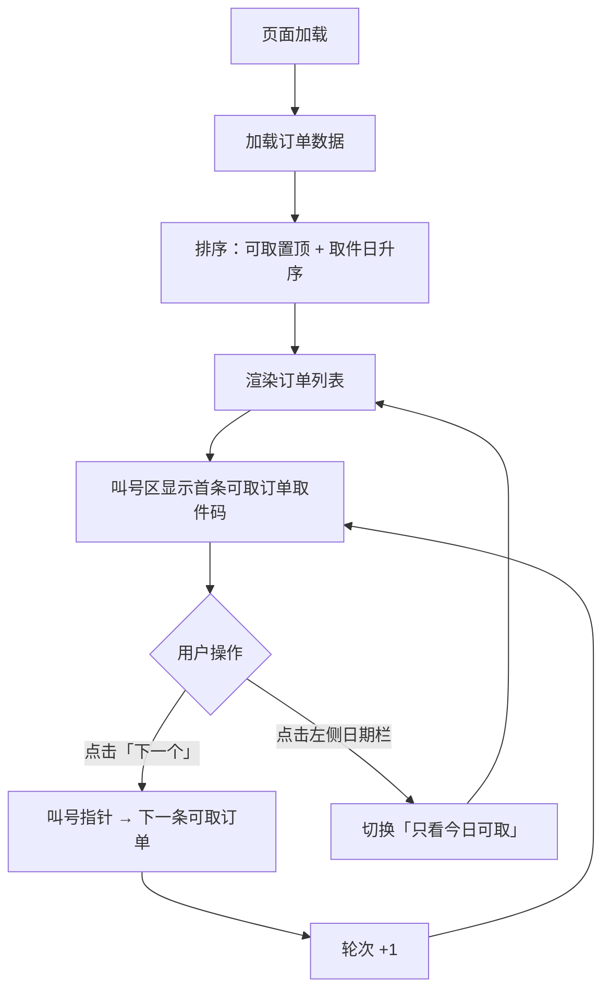

## 1. 产品概述

老城区修鞋摊「取件叫号屏」——一款面向修鞋师傅的纯前端叫号显示屏，帮助顾客快速识别取件状态、有序排队取件。核心价值：用最简操作实现「可取置顶 → 大字叫号 → 一键下一个」的修鞋取件流程。

## 2. 核心功能

### 2.2 功能模块

1. **叫号主屏**：订单列表、叫号区、今日日期侧栏、底部统计栏

### 2.3 页面详情

| 页面名称 | 模块名称 | 功能描述 |
|----------|----------|----------|
| 叫号主屏 | 订单列表区 | 展示全部/过滤后的修鞋订单；可取件订单置顶，其余按预计取件日升序；每行显示取件码、顾客姓、修件类型、预计取件日、可取状态标签 |
| 叫号主屏 | 叫号区 | 大字显示当前第一条可取订单的取件码；点击「下一个」按钮轮转到下一条可取订单（仅前端状态，不改数据）；循环轮转 |
| 叫号主屏 | 今日日期侧栏 | 左侧竖条展示今日日期（年/月/日/星期）；点击可切换「只看今日可取」过滤模式 |
| 叫号主屏 | 底部统计栏 | 显示三项统计：待取数（未可取总数）、今日可取数、已叫号轮次 |

## 3. 核心流程

1. 页面加载 → 读取示例订单数据 → 按规则排序（可取置顶 + 取件日升序）→ 渲染订单列表
2. 叫号区自动定位到第一条可取订单的取件码
3. 师傅点击「下一个」→ 叫号指针移至下一条可取订单 → 轮次 +1
4. 点击左侧日期栏 → 切换「只看今日可取」→ 列表仅显示今日可取的订单
5. 再次点击 → 恢复全部显示

## 4. 用户界面设计

### 4.1 设计风格

- **主色调**：深棕 / 仿旧铜色，体现老城区修鞋摊的质朴手工艺质感
- **辅色**：暖米白底色 + 深炭灰文字 + 琥珀色高亮可取状态
- **字体**：叫号区使用粗黑大字（系统宋体/思源宋体），其余用清晰无衬线体
- **布局**：左侧窄竖栏（日期）+ 中部主列表 + 右上角大字叫号区 + 底部统计条
- **风格**：复古工坊风，略带手写质感，营造老城区市井氛围

### 4.2 页面设计概览

| 页面名称 | 模块名称 | UI 元素 |
|----------|----------|----------|
| 叫号主屏 | 左侧日期栏 | 竖向排列：年、月、日、星期；琥珀色底深色字；点击切换过滤时有脉冲动画 |
| 叫号主屏 | 订单列表 | 卡片行；可取行左侧琥珀色竖条标记；每行：取件码（加粗）、姓、修件类型图标标签、取件日、可取徽章 |
| 叫号主屏 | 叫号区 | 超大取件码数字（如 A017）；下方「下一个」按钮，带按压效果；当前轮次小字提示 |
| 叫号主屏 | 底部统计栏 | 三栏等分：待取数 / 今日可取数 / 已叫号轮次；图标 + 数字 |

### 4.3 响应式

桌面优先设计（叫号屏通常为横屏显示器），适配 1280×720 以上分辨率。
