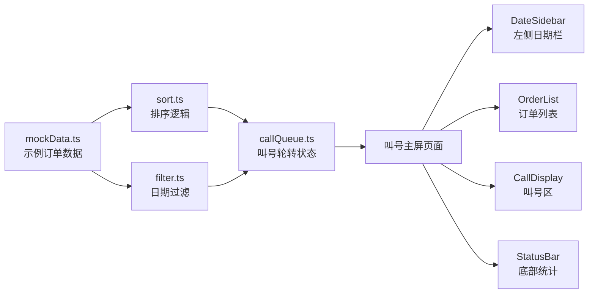

## 1. 架构设计

纯前端单页应用，无后端服务。数据以 Mock 形式内置，排序 / 过滤 / 叫号轮转各自独立模块。



## 2. 技术说明

- **前端框架**：React 18 + TypeScript + Vite
- **样式方案**：Tailwind CSS 3
- **状态管理**：Zustand（叫号轮转状态）
- **路由**：单页无路由需求，不引入 react-router
- **后端**：无
- **数据库**：无，使用内置 Mock 数据
- **部署**：Docker + Nginx 静态托管

## 3. 路由定义

| 路由 | 用途 |
|------|------|
| / | 叫号主屏（唯一页面） |

## 4. 数据模型

### 4.1 订单数据结构

```typescript
interface ShoeOrder {
  id: string
  pickupCode: string
  customerSurname: string
  repairType: "换底" | "缝边" | "上色"
  estimatedPickupDate: string
  isReady: boolean
}
```

### 4.2 叫号轮转状态

```typescript
interface CallQueueState {
  currentReadyOrders: ShoeOrder[]
  currentIndex: number
  callRound: number
  next: () => void
  setReadyOrders: (orders: ShoeOrder[]) => void
}
```

## 5. 模块职责

| 文件 | 职责 |
|------|------|
| src/utils/sort.ts | 订单排序：可取置顶 → 取件日升序 |
| src/utils/filter.ts | 日期过滤：按今日可取过滤 |
| src/store/callQueue.ts | Zustand store：叫号轮转指针、轮次计数、next 方法 |
| src/utils/mockData.ts | 10 条示例修鞋订单数据 |
